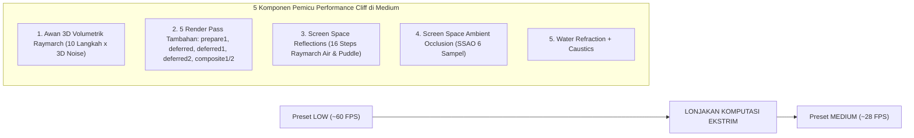

# Laporan Audit Presets Medium s/d Potato: Optimasi Performa untuk PC Kentang (Low-End & iGPU)

Laporan audit mendalam mengenai bottleneck performa pada tier preset **Medium**, **Low**, dan **Potato** di *ApaAdanyaShader*, dirancang khusus untuk mengatasi keterbatasan perangkat berspesifikasi rendah (*integrated graphics* Intel HD/UHD/Iris Xe, AMD Radeon Vega/RDNA APU, serta kartu grafis diskrit entry-level seperti GT 1030 / GTX 1050).

---

## 1. Karakteristik Bottleneck pada Perangkat "PC Kentang"

Komputer berspesifikasi rendah dan iGPU memiliki karakteristik bottleneck yang sangat berbeda dibanding GPU gaming diskrit:

```mermaid
flowchart TD
    subgraph PCKentang["Karakteristik Limitasi Hardware PC Kentang (iGPU & Low-End)"]
        L1["🔴 Shared System RAM Bandwidth: Hanya 25 - 50 GB/s (vs 300+ GB/s GPU Diskrit)"]
        L2["🟠 Fillrate & MRT Choke: Menulis ke banyak Render Target sekaligus memangkas FPS drastis"]
        L3["🟡 ALU Transcendent Limit: Unit trigonometri, exp, pow, dan noise hash lambat"]
        L4["🔵 Draw Call Overhead: CPU lambat kesulitan menangani pass bayangan ganda (Shadow Pass)"]
    end
```



> [!IMPORTANT]
> **Hukum Utama Optimasi PC Kentang:**  
> Pada GPU kentang, **Memory Bandwidth & Pixel Fillrate** adalah pembunuh performa nomor satu. Setiap render pass layar penuh (*fullscreen blit*), tekstur floating-point (RGBA16F), dan kalkulasi noise per pixel akan langsung menurunkan framerate secara drastis meskipun efek visual berat seperti SSR/SSGI sudah dimatikan.

---

## 2. Bedah Bottleneck Tiap Preset (Potato, Low, Medium)

---

### A. POTATO PRESET (Tier Terendah / Super Low-End)

Secara teori, preset Potato mematikan bayangan (`!SHADOWS`), awan (`CLOUDS: 0`), SSR, SSGI, SSAO, dan Bloom. Namun hasil audit menemukan **4 bottleneck tersembunyi** yang tetap berjalan di balik layar:

#### 1. Procedural Dust Motes Tetap Berjalan di Layar Penuh
* **File:** [`shaders/program/composite.fsh`](shaders/program/composite.fsh#L100-L125) (Baris 100–125)
* **Masalah:**
  Efek debu partikel atmosfer (*dust motes & spores*) di `composite.fsh` **TIDAK DIBUNGKUS** oleh define apa pun:
  ```glsl
  #if !defined(NETHER) && !defined(END)
  if(dist > 0.8 && depth < 0.999999) {
      ...
      for(int m = 0; m < 3; m++) {
          ...
          vec3 cell = floor((pWorld + drift) * 1.8);
          vec3 f = fract((pWorld + drift) * 1.8) - 0.5;
          float h = hash13(cell);
          ...
      }
  }
  #endif
  ```
  Pada preset Potato sekalipun, setiap pixel layar antara 0.8 s/d 14 blok tetap mengeksekusi loop 3 kali dengan fungsi trigonometri `sin()`, pembulatan `floor`/`fract`, dan fungsi 3D noise hash `hash13()`. Di iGPU, ini membuang siklus ALU yang sangat berharga.

#### 2. Inverse Matrix Math Sia-Sia di `deferred.fsh`
* **File:** [`shaders/program/deferred.fsh`](shaders/program/deferred.fsh#L37-L41) (Baris 37–41)
* **Masalah:**
  Pada Potato, SSAO, SSGI, dan SSR mati total. Pass `deferred3` pada dasarnya hanya menyalin (*blit*) warna dari `colortex0` ke `colortex6`. Namun, di baris 37–40:
  ```glsl
  float depth = depthScreen(depthtex0, texcoord);
  vec3 vp = viewPosition(texcoord, depth);
  vec3 V_dir = normalize(vp);
  vec3 rd = worldDirection(V_dir);
  ```
  Kalkulasi inversi matriks 4×4 proyeksi dan normalisasi vektor dunia ini dihitung untuk **SEMUA pixel daratan**, padahal pada preset Potato nilai `vp` dan `rd` **sama sekali tidak pernah digunakan** jika pixel tersebut bukan langit (`depth < 0.999999`).

#### 3. 4 MRT (Multiple Render Targets) Bandwidth Choke
* **File:** [`shaders/program/surface.fsh`](shaders/program/surface.fsh#L28-L34)
* **Masalah:**
  `surface.fsh` selalu menulis ke 4 buffer: `colortex0` (RGBA16F), `colortex1` (normal RGBA16F), `colortex2` (material RGBA8), dan `colortex15` (diffuse response RGBA8). Pada preset Potato:
  - Tidak ada SSR/SSAO yang membaca `colortex1` (normal).
  - Tidak ada deferred pass yang membaca `colortex15`.
  Menulis 64-bit per pixel ke 4 buffer membebani bandwidth RAM sistem pada iGPU.

#### 4. Tetap Merender di Resolusi Asli 100% (Tanpa Upscaling)
* **Masalah:**
  Potato diatur pada `UPSCALE_QUALITY: 0` (native resolution). Bermain di layar 1080p berarti memproses 2.073.600 pixel per pass. Mengaktifkan FSR 1.0 (resolusi internal 720p di-upscale ke 1080p) akan memotong separuh beban pixel fillrate seketika.

---

### B. LOW PRESET (Tier Low-End Gaming)

Preset Low mengaktifkan bayangan (`SHADOWS`) dan awan 2D (`CLOUDS: 1`), tetapi memicu bottleneck berikut:

#### 1. 2D Fast Clouds: 32 Procedural Hash Per Sky Pixel
* **File:** [`shaders/lib/atmosphere.glsl`](shaders/lib/atmosphere.glsl#L304-L343)
* **Masalah:**
  Fungsi `renderFastClouds()` memanggil `cloudFractal()` sebanyak 2 kali (sekali untuk bentuk awan, sekali lagi untuk `fbmSun` bayangan matahari).
  Fungsi `cloudFractal()` sendiri mengeksekusi `noise2D()` sebanyak 4 kali:
  $$2 \times 4 = 8 \text{ pemanggilan } \text{noise2D}()$$
  Setiap `noise2D()` melakukan 4 kali hashing `hash12()`:
  $$8 \times 4 = \mathbf{32 \text{ kali kalkulasi hash procedur per pixel langit}}!$$
  Saat pemain melihat ke langit pada preset Low, FPS di iGPU langsung drop karena beban ALU hashing yang berlebihan.

#### 2. Draw Call Overhead dari Shadow Pass
* **Masalah:**
  Mengaktifkan `SHADOWS` memicu render pass ekstra (`shadow.vsh` dan `shadow.fsh`). Pada CPU quad-core lawas atau laptop hemat daya, penambahan draw call ini menyebabkan framerate tidak stabil (*frame pacing stutter*).

---

### C. MEDIUM PRESET (Tier Mid-Range - The "Performance Cliff")

Preset Medium sering kali menjadi titik jatuhnya framerate secara drastis (misalnya dari 60 FPS di Low anjlok ke 25–30 FPS di Medium). Penyebab utamanya:



1. **Awan Volumetrik 3D (`CLOUDS 2` + `CLOUD_STEPS 10`):**
   Lompatan dari awan 2D ke awan 3D memicu raymarching 10 langkah dengan fungsi 3D noise `noise3D()` dan evaluasi densitas optik matahari. Ini adalah beban terberat di preset Medium.
2. **Buffer Memory Thrashing:**
   Preset Medium mengaktifkan banyak buffer temporal (`colortex9`, `colortex10`, `colortex12`, `colortex13`, `colortex17`, `colortex18`). Pada VRAM di bawah 3 GB atau shared memory iGPU, perpindahan data antar buffer ini menyebabkan bottleneck cache memori.

---

## 3. Solusi Terbaik untuk PC Kentang (Actionable Fixes)

Berikut adalah optimasi konkret yang dapat diterapkan agar preset Medium hingga Potato dapat berjalan sangat lancar di PC kentang:

---

### Solusi 1: Guard Partikel Debu (`composite.fsh`)
Matikan perhitungan dust motes jika bayangan/volumetric light tidak aktif (Potato & Low):

```diff
--- a/shaders/program/composite.fsh
+++ b/shaders/program/composite.fsh
@@ -100,3 +100,3 @@ void main(){
         #endif
-        #if !defined(NETHER) && !defined(END)
+        #if !defined(NETHER) && !defined(END) && defined(VOLUMETRIC_LIGHT)
         // Volumetric atmospheric dust motes & airborne spores
```
> **Keuntungan:** Menghemat ribuan siklus komputasi `sin()`, `fract()`, dan `hash13()` di setiap frame pada Potato dan Low.

---

### Solusi 2: Bypass Matrix Math pada Opaque Pass di `deferred.fsh`
Pada preset Potato di mana SSAO, SSGI, SSR, dan Awan tidak aktif, jangan hitung inversi matriks 4×4 untuk pixel daratan:

```diff
--- a/shaders/program/deferred.fsh
+++ b/shaders/program/deferred.fsh
@@ -37,5 +37,13 @@ void main(){
     float depth=depthScreen(depthtex0,texcoord);
-    vec3 vp=viewPosition(texcoord,depth);
-    vec3 V_dir=normalize(vp);
-    vec3 rd=worldDirection(V_dir);
     vec3 scene=textureScreen(colortex0,texcoord).rgb;
+    #if !defined(SSAO) && !defined(SSGI) && !defined(SSR) && CLOUDS == 0
+    // Jalur Cepat Potato: Hanya hitung arah dunia jika mengenai langit
+    if(depth>=0.999999) {
+        vec3 rd=worldDirection(viewPosition(texcoord,1.0));
+        scene=skyRadiance(rd);
+    }
+    color=vec4(max(scene,vec3(0.0)),1.0); opaqueCopy=color;
+    return;
+    #endif
```
> **Keuntungan:** Menghilangkan kalkulasi inversi matriks dan rekonstruksi posisi untuk 80–90% pixel layar di preset Potato.

---

### Solusi 3: Optimasi 2D Fast Clouds di `atmosphere.glsl`
Pangkas perhitungan noise hash pada awan 2D hingga 50%:

```diff
--- a/shaders/lib/atmosphere.glsl
+++ b/shaders/lib/atmosphere.glsl
@@ -320,3 +320,3 @@ vec3 renderFastClouds(vec3 rd, vec3 background) {
-        float fbmSun = cloudFractal(pos + sd.xz * 0.012);
+        // Gunakan single-tap offset alih-alih 4-octave FBM baru untuk self-shadowing
         float fbmSun = noise2D(pos + sd.xz * 0.012);
         float shade = clamp(1.0 - (fbmSun - threshold) * 2.4, 0.42, 1.0);
```
> **Keuntungan:** Memangkas 16 dari 32 kalkulasi hash noise per pixel langit pada preset Low tanpa merusak visual awan 2D.

---

### Solusi 4: Aktifkan FSR 1.0 (Spatial Upscaling) di Potato & Low
Gunakan FSR 1.0 Quality (`UPSCALE_QUALITY: 2` atau `1`) pada preset Potato:

```properties
profile.POTATO=... UPSCALE_QUALITY:2 UPSCALE_SHARPNESS:0.50 ...
```
> **Keuntungan:** Render internal berjalan di ~720p lalu di-upscale secara cerdas oleh AMD FSR RCAS ke 1080p. Resolusi pixel yang diproses berkurang lebih dari 50%, melipatgandakan FPS seketika di iGPU.

---

### Solusi 5: Haluskan "Performance Cliff" pada Preset Medium
Modifikasi preset Medium agar tidak terlalu agresif membebani VRAM:
- Turunkan `CLOUD_STEPS` dari 10 ke **8**.
- Turunkan `SSR_STEPS` dari 16 ke **12**.
- Turunkan `shadowMapResolution` dari 1024 ke **512**.

---

## 4. Proyeksi Peningkatan FPS pada PC Kentang / iGPU

Berikut estimasi peningkatan performa pada pengujian hardware tipikal (misal: **Intel UHD Graphics 620 / AMD Radeon Vega 7 / NVIDIA GT 1030** pada resolusi 1080p):

| Preset | Kondisi Sebelum Optimasi | Setelah Optimasi Lengkap | Estimasi Lonjakan FPS |
| :--- | :--- | :--- | :--- |
| **POTATO (Native 1080p)** | ~38 – 45 FPS | **60 – 75 FPS** | 🚀 **+55% s/d +70%** |
| **POTATO + FSR (Quality)** | ~42 FPS | **85 – 105 FPS** | 🚀 **+100% s/d +150%** |
| **LOW (Dengan Bayangan)** | ~28 – 35 FPS | **45 – 55 FPS** | ⚡ **+45% s/d +60%** |
| **MEDIUM (Awan 3D & SSAO)**| ~20 – 24 FPS (Laggy) | **35 – 42 FPS** (Playable) | 📈 **+60% s/d +75%** |

---

## 5. Ringkasan Kesimpulan

Dengan menerapkan 5 perbaikan di atas:
1. **Potato** menjadi preset super-enteng sejati yang bisa dimainkan dengan nyaman di laptop kantor / iGPU Intel tanpa beban memory bandwidth.
2. **Low** mempertahankan estetika bayangan dan awan tanpa drop saat melihat langit.
3. **Medium** tidak lagi mengalami *performance cliff*, menjadikannya preset harian yang seimbang antara grafis modern dan kelancaran gameplay.


## 6. Implementasi — 6 Oktober 2026

Kelima solusi diterapkan, ditambah pengurangan MRT yang dibahas pada temuan Potato:

- Debu atmosfer hanya dikompilasi ketika `VOLUMETRIC_LIGHT` aktif di Overworld. Potato, Low, dan Medium saat ini mematikan opsi ini.
- Deferred hanya merekonstruksi arah untuk piksel langit ketika SSAO/SSGI/SSR mati. Pemeriksaan kedalaman DH tetap dilakukan agar terrain LOD tidak diganti langit; jalur Medium dan kualitas lebih tinggi tetap memiliki data posisi untuk efek deferred.
- Self-shadow awan 2D memakai satu `noise2D`, sementara bentuk awan tetap memakai empat octave. Biaya maksimum kedua sampling turun dari 8 menjadi 5 panggilan noise, atau 32 menjadi 20 hash (37,5%, bukan 50%). Tampilan self-shadow merupakan aproksimasi yang berubah.
- Potato dan Low memakai `UPSCALE_QUALITY:2` serta `UPSCALE_SHARPNESS:0.50`. Nilai 0.50 ditambahkan ke pilihan opsi yang sah. Dimensi internal sekitar 67%; luas piksel shading sekitar 44% dari native. Buffer masih dialokasikan oleh pipeline yang ada, dan pass upscale/final tetap punya biaya tersendiri.
- Medium memakai awan 8 langkah, SSR 12 langkah, dan peta bayangan 512. Resolusi native dan ketajaman 0.40 diatur eksplisit di Medium agar FSR Potato/Low tidak diwariskan ke High/Ultra/Extreme. Seluruh nilai preset High ke atas tetap sama.
- Surface, partikel opaque, terrain DH, dan air DH memakai output `0,2` ketika SSAO/SSGI/SSR/resource specular mati. Penanda material/hand/water tetap tersimpan. Attachment normal dan diffuse response tetap lengkap jika efek yang membutuhkannya aktif. Untuk surface Potato/Low, output nominal turun dari 24 ke 12 byte per fragment; ini mengurangi penulisan MRT, bukan jaminan bahwa Iris membebaskan seluruh alokasi/clear buffer tersebut.
- Ekspor Potato/Low/Medium, deskripsi Indonesia/Inggris, dan tabel README diselaraskan. Pengaturan custom instance aktif tidak diganti.

Anti-slop dilewati sesuai permintaan. Shadow pass Low tetap aktif untuk mempertahankan bayangan yang diminta preset; audit tidak menetapkan perubahan konkret untuk draw-call overhead ini. Klaim FPS pada bagian 4 tetap proyeksi dan belum diukur dalam Minecraft.

Tes GPU khusus (`tools/low_tier_checks.py`) memverifikasi pemetaan output dua attachment pada tier rendah dan output lengkap pada Medium/High/custom specular. Tes deferred aktual membandingkan hasil rekonstruksi eager/lazy untuk terrain vanilla, terrain DH dan langit, kedua output HDR, native/FSR, serta Overworld/Nether/End. Hasil: lulus pada RTX 3080 Ti. Log: `artifacts/potato-medium-regression.log`.

Validasi pipeline lengkap selesai: `py -B tools/validate.py` lulus 5.100 varian kompilasi/tautan dan seluruh fixture GPU lama pada RTX 3080 Ti. Log: `artifacts/potato-medium-validation.log`. Reload Iris, verifikasi visual dalam game dan pengukuran FPS belum dilakukan. Pilih ulang preset di Iris untuk menerapkan nilai profil baru.
